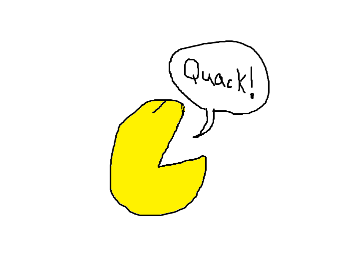

# PacQuack

A duck-themed Pac-Man clone built for the QuackBox gaming console.

<!-- Add a gameplay screenshot above (drop a screenshot.png in this folder) -->

## Tech Stack

- [Godot 4.7](https://godotengine.org/) (Forward+ renderer)
- C# (.NET 8)

## Gameplay

Guide your duck around the maze, gather pellets and fruit bonuses, and avoid the ghosts. Supports keyboard (WASD/arrows) and joypad input.

## Running Locally

1. Install [Godot 4.7 with .NET support](https://godotengine.org/download)
2. Open `project.godot` in Godot
3. Press Play (or run via the `.sln` in your IDE of choice)
